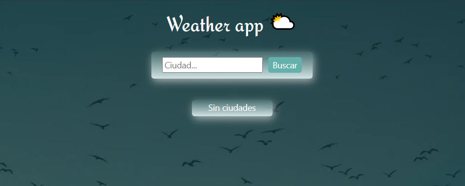
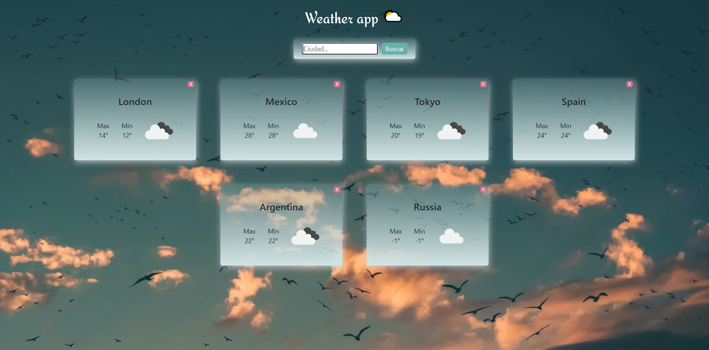

<h1> Weather App </h1>

Desarrollo de una SPA (Single Page Application)
Usando React para el Front-End y Redux como state management. Todos los componentes fueron realizados con CSS sin uso de librerias externas. La SPA consume datos de una Api y en la misma puedes buscar el clima de diferentes ciudades

Development of a SPA (Single Page Application)
Using React for the Front-End and Redux as state management. All the components were made with CSS without the use of external libraries. The SPA consumes data from an API and in it you can search the climate of different cities

